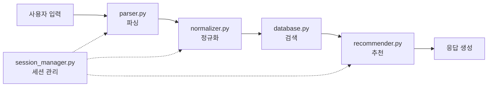

# AI 연구원을 위한 PMark3 개발 가이드

## 📋 개요

이 문서는 AI 연구원(프로젝트팀)이 PMark3 프로토타입을 이해하고 개선하기 위한 상세 가이드입니다. 전문 개발자가 아닌 연구원을 위해 각 함수, 클래스, 파일의 연계 지점과 기능을 상세히 설명합니다.

## 🗂️ 프로젝트 구조 이해

### 전체 파일 구조
```
PMark3/
├── backend/app/
│   ├── agents/parser.py           # 🎯 사용자 입력 파싱
│   ├── logic/
│   │   ├── normalizer.py          # 🔧 용어 정규화
│   │   └── recommender.py         # 💡 추천 엔진
│   ├── api/
│   │   ├── chat.py               # 🌐 채팅 API
│   │   └── work_details.py       # 📝 작업 상세 API
│   ├── database.py               # 🗄️ 데이터베이스 관리
│   ├── session_manager.py        # 👤 세션 관리
│   ├── models.py                 # 📊 데이터 모델
│   └── config.py                 # ⚙️ 설정
├── notebooks/                     # 🧪 실험용 노트북
├── docs/                         # 📚 문서
└── data/                         # 💾 데이터 파일
```

### 핵심 데이터 흐름


## 🎯 핵심 모듈 상세 가이드

### 1. parser.py - 사용자 입력 파싱기

#### 🔍 역할과 목적
- **주 기능**: 자연어 사용자 입력을 구조화된 데이터로 변환
- **처리 시나리오**:
  - S1: 자연어 입력 ("No.1 PE 압력베젤 고장")
  - S2: ITEMNO 입력 ("44043-CA1-6"-P")
  - S3: 세션 컨텍스트 기반 입력

#### 🔧 주요 함수들

```python
class InputParser:
    def parse_input_with_context(self, user_input: str, conversation_history: list, session_id: str):
        """
        🎯 메인 파싱 함수
        
        입력받는 것:
        - user_input: 사용자가 입력한 텍스트
        - conversation_history: 이전 대화 내용
        - session_id: 세션 식별자
        
        반환하는 것:
        - ParsedInput 객체 (location, equipment_type, status_code, priority 포함)
        
        AI 연구원 실험 포인트:
        1. LLM 모델 교체 (GPT-4 → Mistral, Qwen)
        2. 프롬프트 엔지니어링 개선
        3. 시나리오 분기 로직 최적화
        """
    
    def _create_scenario_1_prompt(self, user_input: str):
        """
        🎨 시나리오 1용 프롬프트 생성
        
        실험 가능한 영역:
        - 프롬프트 템플릿 최적화
        - 예시 추가/수정
        - 추출 규칙 개선
        """
```

#### 🧪 실험 방법
```python
# notebooks/01_parser_experiment.ipynb에서 실험
# 1. 다양한 프롬프트 테스트
# 2. LLM 모델 비교
# 3. 정확도 측정

# 실험 예시
parser = InputParser()
test_inputs = [
    "No.1 PE 압력베젤 고장",
    "석유제품배합/저장 Motor Operated Valve 작동불량",
    "44043-CA1-6\"-P Leak 볼팅 작업"
]

for input_text in test_inputs:
    result = parser.parse_input_with_context(input_text, [], "test_session")
    print(f"입력: {input_text}")
    print(f"결과: {result}")
    print(f"신뢰도: {result.confidence}")
```

### 2. normalizer.py - 용어 정규화기

#### 🔍 역할과 목적
- **주 기능**: 파싱된 용어를 표준 용어로 변환
- **현재 방식**: LLM 기반 정규화
- **개선 방향**: 벡터 임베딩 기반 정규화

#### 🔧 주요 함수들

```python
class LLMNormalizer:
    def normalize_term(self, term: str, category: str) -> Tuple[str, float]:
        """
        🔧 용어 정규화 함수
        
        입력받는 것:
        - term: 정규화할 용어 ("압력베젤")
        - category: 카테고리 ("equipment", "location", "status", "priority")
        
        반환하는 것:
        - (정규화된 용어, 신뢰도 점수)
        
        현재의 한계점:
        1. LLM 호출로 인한 지연 시간
        2. 일관성 부족 (같은 입력에 다른 결과)
        3. 비용 문제
        
        AI 연구원 개선 기회:
        1. 벡터 임베딩 기반 정규화 구현
        2. 캐싱 시스템 도입
        3. 하이브리드 접근법 (룰 기반 + 벡터)
        """
    
    def _get_db_terms(self, category: str) -> list:
        """
        📚 DB에서 표준 용어 추출
        
        개선 포인트:
        - 용어 빈도 기반 우선순위
        - 동적 용어 업데이트
        - 다국어 지원
        """
```

#### 🧪 실험 방법
```python
# notebooks/02_normalizer_experiment.ipynb에서 실험

# 현재 방식 vs 벡터 기반 비교
from sentence_transformers import SentenceTransformer

# 1. 현재 LLM 방식 테스트
normalizer = LLMNormalizer()
result1 = normalizer.normalize_term("압력베젤", "equipment")

# 2. 벡터 기반 실험
model = SentenceTransformer('jhgan/ko-sbert-multitask')
# 벡터 유사도 기반 정규화 실험
```

### 3. recommender.py - 추천 엔진

#### 🔍 역할과 목적
- **주 기능**: 파싱된 입력을 기반으로 유사한 작업 추천
- **현재 방식**: 문자열 유사도 + 가중치 계산
- **개선 방향**: 벡터 검색 + 협업 필터링

#### 🔧 주요 함수들

```python
class RecommendationEngine:
    def get_recommendations(self, parsed_input: ParsedInput, limit: int = 5):
        """
        💡 추천 생성 함수
        
        처리 과정:
        1. database.py를 통해 유사한 작업 검색
        2. 유사도 점수 계산
        3. 우선순위 정렬
        4. 상위 N개 반환
        
        AI 연구원 개선 기회:
        1. 벡터 검색 도입
        2. 협업 필터링 적용
        3. 컨텍스트 기반 추천
        4. 사용자 피드백 학습
        """
    
    def _calculate_simple_similarity_score(self, parsed_input, notification):
        """
        📊 유사도 점수 계산
        
        현재 가중치:
        - 설비유형: 35%
        - 위치: 35%
        - 현상코드: 20%
        - 우선순위: 10%
        
        실험 포인트:
        1. 가중치 최적화
        2. 새로운 유사도 메트릭 도입
        3. 상황별 동적 가중치
        """
```

#### 🧪 실험 방법
```python
# notebooks/03_recommender_experiment.ipynb에서 실험

# 1. 가중치 조정 실험
weights_experiments = [
    {"location": 0.4, "equipment": 0.3, "status": 0.2, "priority": 0.1},
    {"location": 0.3, "equipment": 0.4, "status": 0.2, "priority": 0.1},
    {"location": 0.35, "equipment": 0.35, "status": 0.25, "priority": 0.05}
]

# 2. 벡터 기반 추천 실험
# 3. 협업 필터링 실험
```

### 4. database.py - 데이터베이스 관리자

#### 🔍 역할과 목적
- **주 기능**: 데이터 검색 및 관리
- **현재**: SQLite 사용
- **Production**: Azure SQL Database 연동 예정

#### 🔧 주요 함수들

```python
class DatabaseManager:
    def search_similar_notifications(self, equip_type=None, location=None, 
                                   status_code=None, priority=None, limit=15):
        """
        🔍 유사한 작업 검색
        
        검색 전략:
        1. 위치 기반 우선 검색
        2. 설비유형 매칭
        3. 현상코드 매칭
        4. 우선순위 고려
        
        AI 연구원 실험 포인트:
        1. 검색 알고리즘 개선
        2. 인덱싱 최적화
        3. 벡터 검색 통합
        """
    
    def search_by_itemno(self, itemno: str, limit: int = 15):
        """
        🎯 ITEMNO 기반 검색
        
        검색 단계:
        1. 정확한 매칭
        2. 부분 매칭
        3. 패턴 유사성 검색
        
        개선 기회:
        - 퍼지 매칭 알고리즘
        - 정규표현식 최적화
        """
```

### 5. session_manager.py - 세션 관리자

#### 🔍 역할과 목적
- **주 기능**: 대화 컨텍스트 유지 및 관리
- **현재**: 메모리 기반 세션
- **Production**: Redis/Azure Cache 활용 예정

#### 🔧 주요 함수들

```python
class SessionManager:
    def create_session(self) -> str:
        """
        👤 새 세션 생성
        
        포함 정보:
        - 세션 ID
        - 생성 시간
        - 대화 히스토리
        - 컨텍스트 요약
        """
    
    def update_session(self, session_id: str, message: str, context: dict):
        """
        🔄 세션 정보 업데이트
        
        관리 요소:
        - 메시지 히스토리
        - 컨텍스트 누적
        - 세션 만료 관리
        """
```

## 🧪 실험 환경 구성

### 실험용 데이터 준비

```python
# 실험용 샘플 데이터 생성
sample_inputs = [
    {
        "input": "No.1 PE 압력베젤 고장",
        "expected": {
            "location": "No.1 PE",
            "equipment_type": "Pressure Vessel",
            "status_code": "고장",
            "priority": None
        }
    },
    {
        "input": "석유제품배합/저장 Motor Operated Valve 작동불량. 긴급작업 요망",
        "expected": {
            "location": "석유제품배합/저장",
            "equipment_type": "Motor Operated Valve",
            "status_code": "작동불량",
            "priority": "긴급작업"
        }
    }
]

# Ground Truth 데이터셋 구성
ground_truth = {
    "parsing_accuracy": sample_inputs,
    "normalization_pairs": [
        ("압력베젤", "[VEDR]Pressure Vessel/ Drum"),
        ("모터밸브", "[MVVV]Motor Operated Valve/ Motor Operated Valve")
    ],
    "recommendation_relevance": [
        # 쿼리와 관련 있는 작업 ID 매핑
    ]
}
```

### 성능 측정 도구

```python
class ExperimentTracker:
    """
    실험 결과 추적 및 분석
    
    사용법:
    1. tracker = ExperimentTracker("parsing_experiment")
    2. tracker.log_result(model="gpt-4", accuracy=0.95, speed=1.2)
    3. tracker.compare_models()
    """
    
    def __init__(self, experiment_name: str):
        self.experiment_name = experiment_name
        self.results = []
    
    def log_result(self, **metrics):
        """실험 결과 기록"""
        result = {
            "timestamp": datetime.now(),
            "metrics": metrics
        }
        self.results.append(result)
    
    def compare_models(self) -> pd.DataFrame:
        """모델 성능 비교"""
        df = pd.DataFrame([r["metrics"] for r in self.results])
        return df.describe()
    
    def plot_performance(self, metric_name: str):
        """성능 시각화"""
        import matplotlib.pyplot as plt
        
        values = [r["metrics"].get(metric_name, 0) for r in self.results]
        plt.plot(values)
        plt.title(f"{metric_name} Performance")
        plt.ylabel(metric_name)
        plt.xlabel("Experiment")
        plt.show()
```

## 🔬 실험 가이드라인

### 1. 파싱 로직 실험

```python
# 목표: 파싱 정확도 향상
# 방법: 프롬프트 최적화, 모델 교체

# 실험 1: 프롬프트 최적화
prompts = [
    "기존 프롬프트",
    "예시가 추가된 프롬프트", 
    "단계별 추출 프롬프트"
]

for prompt in prompts:
    accuracy = test_parsing_with_prompt(prompt)
    tracker.log_result(prompt_type=prompt, accuracy=accuracy)

# 실험 2: LLM 모델 비교
models = ["gpt-4", "gpt-3.5-turbo", "mistral-7b", "qwen3-14b"]

for model in models:
    parser = InputParser(model=model)
    accuracy, speed = evaluate_parser(parser)
    tracker.log_result(model=model, accuracy=accuracy, speed=speed)
```

### 2. 정규화 실험

```python
# 목표: 정규화 일관성 및 속도 향상
# 방법: 벡터 기반 정규화 도입

# 실험 1: LLM vs 벡터 임베딩
from sentence_transformers import SentenceTransformer

# LLM 방식
llm_normalizer = LLMNormalizer()
llm_accuracy = evaluate_normalization(llm_normalizer)

# 벡터 방식
vector_model = SentenceTransformer('jhgan/ko-sbert-multitask')
vector_normalizer = VectorNormalizer(vector_model)
vector_accuracy = evaluate_normalization(vector_normalizer)

# 결과 비교
tracker.log_result(method="llm", accuracy=llm_accuracy)
tracker.log_result(method="vector", accuracy=vector_accuracy)
```

### 3. 추천 시스템 실험

```python
# 목표: 추천 정확도 및 다양성 향상
# 방법: 벡터 검색, 협업 필터링 도입

# 실험 1: 유사도 메트릭 비교
similarity_functions = [
    "levenshtein",
    "cosine_similarity", 
    "jaccard",
    "semantic_similarity"
]

for sim_func in similarity_functions:
    recommender = RecommendationEngine(similarity=sim_func)
    precision, recall = evaluate_recommendations(recommender)
    tracker.log_result(similarity=sim_func, precision=precision, recall=recall)
```

## 🎯 실험 우선순위

### 높은 우선순위 (즉시 실험 가능)
1. **파싱 프롬프트 최적화**: 현재 코드 수정 없이 프롬프트만 변경
2. **유사도 가중치 조정**: recommender.py의 가중치 실험
3. **정규화 임계값 조정**: 신뢰도 임계값 최적화

### 중간 우선순위 (벡터 시스템 구축 후)
1. **벡터 기반 정규화**: SentenceTransformer 활용
2. **벡터 검색 시스템**: FAISS, Chroma 등 도입
3. **하이브리드 추천**: 기존 + 벡터 검색 결합

### 낮은 우선순위 (Production 전환 시)
1. **로컬 LLM 통합**: vLLM 기반 서빙
2. **실시간 학습 시스템**: 사용자 피드백 반영
3. **멀티모달 지원**: 이미지, 음성 입력 처리

## 💡 실험 시 주의사항

### 1. 재현성 확보
```python
# 실험 환경 고정
import random
import numpy as np

def set_random_seed(seed=42):
    random.seed(seed)
    np.random.seed(seed)
    # torch.manual_seed(seed) if using PyTorch

# 모든 실험 시작 시 호출
set_random_seed(42)
```

### 2. 성능 측정 일관성
```python
# 성능 측정 표준화
def measure_performance(func, *args, **kwargs):
    start_time = time.time()
    result = func(*args, **kwargs)
    end_time = time.time()
    
    return {
        "result": result,
        "execution_time": end_time - start_time,
        "memory_usage": get_memory_usage()
    }
```

### 3. 실험 결과 문서화
```python
# 실험 보고서 자동 생성
def generate_experiment_report(tracker: ExperimentTracker):
    report = f"""
    # 실험 보고서: {tracker.experiment_name}
    
    ## 실험 개요
    - 실험 일시: {datetime.now()}
    - 실험 횟수: {len(tracker.results)}
    
    ## 주요 결과
    {tracker.compare_models().to_string()}
    
    ## 권장사항
    - 최고 성능 모델: {tracker.get_best_model()}
    - 개선 포인트: {tracker.get_improvement_suggestions()}
    """
    
    with open(f"reports/{tracker.experiment_name}_report.md", "w") as f:
        f.write(report)
```

---

이 가이드를 통해 AI 연구원들이 PMark3 시스템을 깊이 이해하고, 효과적인 실험을 통해 시스템을 개선할 수 있기를 바랍니다. 각 실험 결과는 개발팀과 공유하여 Production 시스템에 반영해 주세요. 