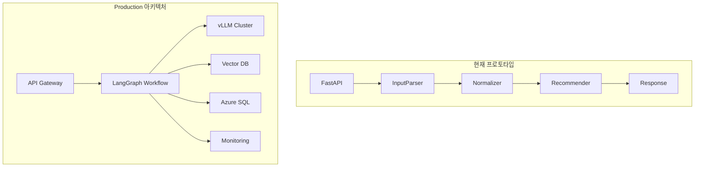

# 개발팀을 위한 PMark3 Production 가이드

## 📋 개요

이 문서는 개발팀이 PMark3 프로토타입을 Production 환경으로 전환하기 위한 기술적 가이드입니다. LangGraph 아키텍처, Azure 인프라, 로컬 LLM 서빙, 성능 최적화 등 Production 수준의 구현에 필요한 모든 정보를 포함합니다.

## 🏗️ 아키텍처 전환 전략

### 현재 프로토타입 vs Production 아키텍처



### 마이그레이션 단계

1. **Phase 1**: 현재 코드 기반 개선 (성능 최적화, 안정성 강화)
2. **Phase 2**: LangGraph 도입 (워크플로우 그래프화)
3. **Phase 3**: 인프라 전환 (Azure 이전, 로컬 LLM 도입)
4. **Phase 4**: 벡터 검색 시스템 통합
5. **Phase 5**: 운영 최적화 (모니터링, 자동화)

## 🚀 LangGraph 기반 아키텍처 구현

### 1. 워크플로우 상태 관리

```python
from typing import TypedDict, Optional, List, Dict, Any
from langgraph.graph import StateGraph, END
import asyncio
import time
import logging

class ProductionWorkflowState(TypedDict):
    """
    Production 워크플로우 상태 정의
    
    설계 원칙:
    1. 불변성: 상태 변경은 새로운 상태 객체 생성
    2. 직렬화 가능: Redis/Azure Cache 저장 지원
    3. 타입 안전성: TypedDict로 타입 체크
    4. 확장성: 새로운 필드 추가 용이
    """
    # 입력 데이터
    user_input: str
    session_id: str
    request_id: str
    
    # 처리 단계별 결과
    parsed_data: Optional[Dict[str, Any]]
    normalized_data: Optional[Dict[str, Any]]
    vector_search_results: Optional[List[Dict]]
    recommendations: Optional[List[Dict]]
    final_response: Optional[str]
    
    # 컨텍스트 정보
    session_context: Dict[str, Any]
    conversation_history: List[Dict[str, Any]]
    
    # 메타데이터
    current_step: str
    processing_start_time: float
    step_timings: Dict[str, float]
    
    # 에러 및 품질 관리
    errors: List[Dict[str, Any]]
    warnings: List[str]
    quality_scores: Dict[str, float]
    
    # 설정
    config: Dict[str, Any]


class ProductionWorkflowBuilder:
    """
    Production용 LangGraph 워크플로우 빌더
    
    핵심 설계 패턴:
    1. 책임 분리: 각 노드는 단일 책임
    2. 에러 경계: 노드별 에러 처리
    3. 관측 가능성: 모든 단계에서 메트릭 수집
    4. 복원력: 장애 시 자동 복구
    """
    
    def __init__(self, config: ProductionConfig):
        self.config = config
        self.logger = logging.getLogger(__name__)
        self.metrics_collector = MetricsCollector()
        self.state_manager = StateManager(config.redis_url)
        
    def build_workflow(self) -> CompiledGraph:
        """
        Production 워크플로우 구성
        
        워크플로우 구조:
        1. 입력 검증 → 파싱 → 정규화
        2. 조건부 분기: 벡터 검색 여부
        3. 추천 생성 → 응답 생성
        4. 품질 검증 → 최종 응답
        
        에러 처리:
        - 각 노드에서 예외 발생 시 에러 노드로 분기
        - 재시도 가능한 에러는 자동 재시도
        - 치명적 에러는 즉시 에러 응답
        """
        workflow = StateGraph(ProductionWorkflowState)
        
        # 노드 등록
        workflow.add_node("validate_input", self._validate_input_node)
        workflow.add_node("parse_input", self._parse_input_node)
        workflow.add_node("normalize_terms", self._normalize_terms_node)
        workflow.add_node("vector_search", self._vector_search_node)
        workflow.add_node("generate_recommendations", self._generate_recommendations_node)
        workflow.add_node("generate_response", self._generate_response_node)
        workflow.add_node("quality_check", self._quality_check_node)
        workflow.add_node("handle_error", self._handle_error_node)
        
        # 엣지 정의
        self._define_workflow_edges(workflow)
        
        # 시작점 설정
        workflow.set_entry_point("validate_input")
        
        return workflow.compile()
    
    async def _validate_input_node(self, state: ProductionWorkflowState) -> ProductionWorkflowState:
        """
        입력 검증 노드
        
        검증 항목:
        1. 입력 길이 제한 (1-1000자)
        2. 금지 문자 필터링
        3. 인코딩 검증 (UTF-8)
        4. 세션 유효성 검사
        
        에러 처리:
        - 검증 실패 시 에러 상태로 전환
        - 상세한 에러 메시지 제공
        """
        start_time = time.time()
        
        try:
            # 기본 입력 검증
            user_input = state["user_input"].strip()
            
            if not user_input:
                raise ValueError("Empty input provided")
            
            if len(user_input) > 1000:
                raise ValueError("Input too long (max 1000 characters)")
            
            if len(user_input) < 3:
                raise ValueError("Input too short (min 3 characters)")
            
            # 세션 유효성 검사
            session_id = state["session_id"]
            if not await self.state_manager.is_session_valid(session_id):
                raise ValueError(f"Invalid session: {session_id}")
            
            # 상태 업데이트
            state["current_step"] = "input_validated"
            state["step_timings"]["validation"] = time.time() - start_time
            
            self.logger.info(f"Input validation passed for session {session_id}")
            return state
            
        except Exception as e:
            # 에러 상태로 전환
            state["current_step"] = "validation_error"
            state["errors"].append({
                "step": "validation",
                "error": str(e),
                "timestamp": time.time()
            })
            
            self.logger.error(f"Input validation failed: {e}")
            return state
    
    async def _parse_input_node(self, state: ProductionWorkflowState) -> ProductionWorkflowState:
        """
        입력 파싱 노드
        
        처리 과정:
        1. 로컬 LLM 클라이언트 초기화
        2. 세션 컨텍스트 로드
        3. 시나리오 분기 (S1/S2/S3)
        4. LLM 호출 및 파싱
        5. 결과 검증 및 후처리
        
        성능 최적화:
        - 배치 처리 지원
        - 결과 캐싱
        - 타임아웃 관리
        """
        start_time = time.time()
        
        try:
            # LLM 클라이언트 초기화
            llm_client = await self._get_llm_client()
            
            # 세션 컨텍스트 로드
            session_context = await self.state_manager.get_session_context(
                state["session_id"]
            )
            
            # 파서 초기화
            parser = ProductionInputParser(
                llm_client=llm_client,
                config=self.config.parser_config
            )
            
            # 파싱 실행
            parsed_result = await parser.parse_with_context(
                user_input=state["user_input"],
                session_context=session_context,
                conversation_history=state["conversation_history"]
            )
            
            # 결과 검증
            if parsed_result.confidence < self.config.min_parsing_confidence:
                state["warnings"].append(
                    f"Low parsing confidence: {parsed_result.confidence}"
                )
            
            # 상태 업데이트
            state["parsed_data"] = parsed_result.to_dict()
            state["current_step"] = "parsing_completed"
            state["step_timings"]["parsing"] = time.time() - start_time
            state["quality_scores"]["parsing"] = parsed_result.confidence
            
            # 메트릭 수집
            await self.metrics_collector.record_parsing_metrics(
                session_id=state["session_id"],
                input_length=len(state["user_input"]),
                parsing_time=time.time() - start_time,
                confidence=parsed_result.confidence,
                scenario=parsed_result.scenario
            )
            
            return state
            
        except Exception as e:
            # 에러 처리
            state["current_step"] = "parsing_error"
            state["errors"].append({
                "step": "parsing",
                "error": str(e),
                "timestamp": time.time(),
                "input_sample": state["user_input"][:100]  # 디버깅용
            })
            
            # 에러 메트릭 수집
            await self.metrics_collector.record_error(
                step="parsing",
                error_type=type(e).__name__,
                session_id=state["session_id"]
            )
            
            return state
    
    async def _normalize_terms_node(self, state: ProductionWorkflowState) -> ProductionWorkflowState:
        """
        용어 정규화 노드
        
        정규화 전략:
        1. 캐시 우선 확인
        2. 벡터 기반 정규화 (활성화된 경우)
        3. LLM 기반 폴백 정규화
        4. 결과 캐싱 및 품질 평가
        
        벡터 기반 정규화 로직:
        - 입력 용어 임베딩 생성
        - 벡터 DB에서 유사 표준 용어 검색
        - 유사도 임계값 기반 정규화
        """
        start_time = time.time()
        
        try:
            parsed_data = state["parsed_data"]
            if not parsed_data:
                raise ValueError("No parsed data available for normalization")
            
            # 정규화 엔진 초기화
            if self.config.vector_normalization_enabled:
                normalizer = VectorBasedNormalizer(
                    vector_db=await self._get_vector_db(),
                    embedding_service=await self._get_embedding_service()
                )
            else:
                normalizer = LLMNormalizer(
                    llm_client=await self._get_llm_client()
                )
            
            # 각 필드별 정규화
            normalized_results = {}
            categories = ["location", "equipment_type", "status_code", "priority"]
            
            for category in categories:
                if parsed_data.get(category):
                    term = parsed_data[category]
                    
                    # 정규화 실행
                    normalized_term, confidence = await normalizer.normalize_term(
                        term=term,
                        category=category
                    )
                    
                    normalized_results[category] = {
                        "original": term,
                        "normalized": normalized_term,
                        "confidence": confidence
                    }
            
            # 상태 업데이트
            state["normalized_data"] = normalized_results
            state["current_step"] = "normalization_completed"
            state["step_timings"]["normalization"] = time.time() - start_time
            
            # 품질 점수 계산
            avg_confidence = sum(
                result["confidence"] for result in normalized_results.values()
            ) / len(normalized_results) if normalized_results else 0
            
            state["quality_scores"]["normalization"] = avg_confidence
            
            return state
            
        except Exception as e:
            state["current_step"] = "normalization_error"
            state["errors"].append({
                "step": "normalization",
                "error": str(e),
                "timestamp": time.time()
            })
            return state
    
    async def _vector_search_node(self, state: ProductionWorkflowState) -> ProductionWorkflowState:
        """
        벡터 검색 노드
        
        검색 과정:
        1. 정규화된 데이터를 쿼리로 변환
        2. 쿼리 임베딩 생성
        3. 벡터 DB에서 유사 문서 검색
        4. 결과 필터링 및 랭킹
        5. 기존 DB 검색 결과와 병합
        
        성능 최적화:
        - 병렬 검색 (다중 컬렉션)
        - 결과 캐싱
        - 적응적 임계값 조정
        """
        start_time = time.time()
        
        try:
            normalized_data = state["normalized_data"]
            if not normalized_data:
                # 벡터 검색 생략
                state["vector_search_results"] = []
                state["current_step"] = "vector_search_skipped"
                return state
            
            # 벡터 DB 및 임베딩 서비스 초기화
            vector_db = await self._get_vector_db()
            embedding_service = await self._get_embedding_service()
            
            # 검색 쿼리 생성
            search_query = self._build_search_query(normalized_data)
            
            # 쿼리 임베딩 생성
            query_embedding = await embedding_service.encode_batch(
                texts=[search_query],
                model_name=self.config.search_embedding_model
            )
            
            # 벡터 검색 실행
            search_tasks = []
            
            # 각 컬렉션별 병렬 검색
            collections = ["equipment_docs", "procedure_docs", "location_docs"]
            for collection in collections:
                task = vector_db.search(
                    embedding=query_embedding[0],
                    collection=collection,
                    top_k=10,
                    threshold=self.config.vector_search_threshold
                )
                search_tasks.append(task)
            
            # 병렬 실행
            search_results = await asyncio.gather(*search_tasks)
            
            # 결과 병합 및 랭킹
            merged_results = self._merge_and_rank_vector_results(search_results)
            
            # 상태 업데이트
            state["vector_search_results"] = merged_results
            state["current_step"] = "vector_search_completed"
            state["step_timings"]["vector_search"] = time.time() - start_time
            
            # 검색 품질 평가
            search_quality = self._evaluate_search_quality(merged_results)
            state["quality_scores"]["vector_search"] = search_quality
            
            return state
            
        except Exception as e:
            state["current_step"] = "vector_search_error"
            state["errors"].append({
                "step": "vector_search",
                "error": str(e),
                "timestamp": time.time()
            })
            return state
    
    def _define_workflow_edges(self, workflow: StateGraph):
        """
        워크플로우 엣지 정의
        
        분기 로직:
        1. 입력 검증 실패 → 에러 처리
        2. 파싱 성공 → 정규화
        3. 벡터 검색 활성화 여부 분기
        4. 품질 점수 기반 재처리 분기
        """
        # 순차 엣지
        workflow.add_conditional_edges(
            "validate_input",
            self._validation_router,
            {
                "continue": "parse_input",
                "error": "handle_error"
            }
        )
        
        workflow.add_conditional_edges(
            "parse_input",
            self._parsing_router,
            {
                "continue": "normalize_terms",
                "error": "handle_error"
            }
        )
        
        workflow.add_conditional_edges(
            "normalize_terms",
            self._normalization_router,
            {
                "use_vector": "vector_search",
                "skip_vector": "generate_recommendations",
                "error": "handle_error"
            }
        )
        
        workflow.add_edge("vector_search", "generate_recommendations")
        workflow.add_edge("generate_recommendations", "generate_response")
        workflow.add_edge("generate_response", "quality_check")
        
        workflow.add_conditional_edges(
            "quality_check",
            self._quality_router,
            {
                "approved": END,
                "retry": "parse_input",
                "error": "handle_error"
            }
        )
        
        workflow.add_edge("handle_error", END)
    
    def _validation_router(self, state: ProductionWorkflowState) -> str:
        """입력 검증 결과에 따른 라우팅"""
        if state["current_step"] == "validation_error":
            return "error"
        return "continue"
    
    def _parsing_router(self, state: ProductionWorkflowState) -> str:
        """파싱 결과에 따른 라우팅"""
        if state["current_step"] == "parsing_error":
            return "error"
        return "continue"
    
    def _normalization_router(self, state: ProductionWorkflowState) -> str:
        """정규화 결과에 따른 라우팅"""
        if state["current_step"] == "normalization_error":
            return "error"
        
        # 벡터 검색 사용 여부 결정
        conditions = [
            self.config.vector_search_enabled,
            state["quality_scores"].get("normalization", 0) > 0.7,
            len(state.get("conversation_history", [])) > 0
        ]
        
        if all(conditions):
            return "use_vector"
        else:
            return "skip_vector"
    
    def _quality_router(self, state: ProductionWorkflowState) -> str:
        """품질 검증 결과에 따른 라우팅"""
        overall_quality = sum(state["quality_scores"].values()) / len(state["quality_scores"])
        
        if overall_quality < self.config.min_quality_threshold:
            retry_count = len([e for e in state["errors"] if "retry" in e.get("tags", [])])
            if retry_count < self.config.max_retry_count:
                return "retry"
            else:
                return "error"
        
        return "approved"


class ProductionInputParser:
    """
    Production용 입력 파서
    
    개선사항:
    1. 로컬 LLM 통합
    2. 배치 처리 지원
    3. 캐싱 및 재시도 로직
    4. 상세한 에러 처리
    """
    
    def __init__(self, llm_client: LocalLLMClient, config: ParserConfig):
        self.llm_client = llm_client
        self.config = config
        self.cache = ParsingCache(maxsize=1000, ttl=3600)
        
    async def parse_with_context(self, 
                               user_input: str, 
                               session_context: Dict,
                               conversation_history: List[Dict]) -> ParsedInput:
        """
        컨텍스트를 활용한 입력 파싱
        
        최적화 기법:
        1. 캐시 우선 확인
        2. 배치 처리 (동일 세션 내 요청)
        3. 적응적 프롬프트 선택
        4. 결과 후처리 및 검증
        """
        # 캐시 확인
        cache_key = self._generate_cache_key(user_input, session_context)
        cached_result = self.cache.get(cache_key)
        if cached_result:
            return cached_result
        
        # 시나리오 분석
        scenario = self._detect_scenario(user_input, conversation_history)
        
        # 프롬프트 생성
        prompt = self._create_contextual_prompt(
            user_input=user_input,
            scenario=scenario,
            session_context=session_context,
            conversation_history=conversation_history
        )
        
        # LLM 호출 (재시도 로직 포함)
        max_retries = 3
        for attempt in range(max_retries):
            try:
                response = await self.llm_client.generate(
                    prompt=prompt,
                    max_tokens=512,
                    temperature=0.1,
                    timeout=30
                )
                
                # 응답 파싱
                parsed_result = self._parse_llm_response(response)
                
                # 결과 검증
                if self._validate_parsing_result(parsed_result):
                    # 캐시 저장
                    self.cache.set(cache_key, parsed_result)
                    return parsed_result
                else:
                    raise ValueError("Parsing result validation failed")
                    
            except Exception as e:
                if attempt == max_retries - 1:
                    raise
                await asyncio.sleep(0.5 * (attempt + 1))  # 백오프
        
        raise RuntimeError("Parsing failed after all retries")
```

## 🔧 Azure 인프라 구성

### 1. Infrastructure as Code

```python
# infrastructure/azure_deployment.py
class AzureInfrastructureManager:
    """
    Azure 인프라 관리
    
    구성 요소:
    1. Azure SQL Database (고가용성)
    2. Azure Kubernetes Service (AKS)
    3. Azure Container Registry (ACR)
    4. Azure Key Vault (시크릿 관리)
    5. Azure Monitor (모니터링)
    6. Azure Application Gateway (로드 밸런싱)
    """
    
    def __init__(self, config: AzureConfig):
        self.config = config
        self.resource_client = ResourceManagementClient(
            credential=DefaultAzureCredential(),
            subscription_id=config.subscription_id
        )
        
    async def deploy_full_stack(self) -> DeploymentResult:
        """
        전체 스택 배포
        
        배포 순서:
        1. 리소스 그룹 생성
        2. 네트워킹 (VNet, 서브넷)
        3. Key Vault (시크릿 저장소)
        4. Azure SQL Database
        5. Container Registry
        6. AKS 클러스터
        7. Application Gateway
        8. 모니터링 설정
        """
        deployment_steps = [
            self._create_resource_group,
            self._setup_networking,
            self._create_key_vault,
            self._deploy_sql_database,
            self._create_container_registry,
            self._deploy_aks_cluster,
            self._setup_application_gateway,
            self._configure_monitoring
        ]
        
        results = {}
        for i, step_func in enumerate(deployment_steps):
            step_name = step_func.__name__
            try:
                self.logger.info(f"Executing step {i+1}: {step_name}")
                result = await step_func()
                results[step_name] = result
                self.logger.info(f"Completed step {i+1}: {step_name}")
            except Exception as e:
                self.logger.error(f"Failed step {i+1}: {step_name} - {e}")
                # 롤백 로직
                await self._rollback_deployment(results)
                raise
        
        return DeploymentResult(
            status="success",
            components=results,
            endpoints=self._extract_endpoints(results)
        )
    
    async def _deploy_sql_database(self) -> Dict[str, Any]:
        """
        Azure SQL Database 배포
        
        설정:
        - 고가용성 (Zone Redundant)
        - 자동 백업 (PITR 35일)
        - 암호화 (TDE)
        - 방화벽 규칙
        - 연결 풀링
        """
        sql_config = {
            "server_name": f"{self.config.project_name}-sql-{self.config.environment}",
            "database_name": f"{self.config.project_name}-db",
            "location": self.config.primary_region,
            "tier": "Standard",
            "service_objective": "S2",
            "max_size_bytes": 268435456000,  # 250GB
            "zone_redundant": True,
            "backup_retention_days": 35,
            "geo_redundant_backup": True
        }
        
        # ARM 템플릿 사용
        template = self._load_arm_template("sql-database-template.json")
        
        deployment_result = await self.resource_client.deployments.begin_create_or_update(
            resource_group_name=self.config.resource_group_name,
            deployment_name=f"sql-deployment-{int(time.time())}",
            parameters={
                "template": template,
                "parameters": sql_config
            }
        ).result()
        
        # 연결 문자열 생성 및 Key Vault 저장
        connection_string = self._build_sql_connection_string(sql_config)
        await self._store_secret("sql-connection-string", connection_string)
        
        # 데이터베이스 초기화
        await self._initialize_database(connection_string)
        
        return {
            "server_fqdn": f"{sql_config['server_name']}.database.windows.net",
            "database_name": sql_config["database_name"],
            "connection_secret": "sql-connection-string"
        }
    
    async def _deploy_aks_cluster(self) -> Dict[str, Any]:
        """
        AKS 클러스터 배포
        
        설정:
        - 다중 노드 풀 (시스템/사용자)
        - GPU 노드 (vLLM용)
        - 자동 스케일링
        - Azure AD 통합
        - 네트워크 정책
        """
        aks_config = {
            "cluster_name": f"{self.config.project_name}-aks-{self.config.environment}",
            "location": self.config.primary_region,
            "kubernetes_version": "1.28.0",
            "dns_prefix": f"{self.config.project_name}-aks",
            
            # 시스템 노드 풀
            "system_node_pool": {
                "name": "systempool",
                "node_count": 3,
                "vm_size": "Standard_D4s_v3",
                "os_disk_size": 100,
                "auto_scaling": True,
                "min_count": 1,
                "max_count": 5
            },
            
            # GPU 노드 풀 (vLLM용)
            "gpu_node_pool": {
                "name": "gpupool",
                "node_count": 2,
                "vm_size": "Standard_NC6s_v3",  # Tesla V100
                "os_disk_size": 200,
                "auto_scaling": True,
                "min_count": 1,
                "max_count": 4,
                "node_taints": ["gpu=true:NoSchedule"]
            }
        }
        
        # AKS 클러스터 생성
        cluster_result = await self._create_aks_cluster(aks_config)
        
        # kubectl 설정
        await self._configure_kubectl(aks_config["cluster_name"])
        
        # 필수 애드온 설치
        await self._install_aks_addons()
        
        return {
            "cluster_name": aks_config["cluster_name"],
            "cluster_fqdn": cluster_result["fqdn"],
            "node_pools": ["systempool", "gpupool"]
        }


class vLLMDeploymentManager:
    """
    vLLM 서비스 배포 관리
    
    배포 전략:
    1. 모델별 전용 노드 풀
    2. GPU 리소스 격리
    3. 자동 스케일링
    4. 롤링 업데이트
    5. 헬스체크 및 모니터링
    """
    
    def __init__(self, k8s_client, config: vLLMConfig):
        self.k8s_client = k8s_client
        self.config = config
        
    async def deploy_vllm_service(self, model_name: str) -> Dict[str, Any]:
        """
        vLLM 서비스 배포
        
        배포 구성:
        1. Deployment (vLLM 서버)
        2. Service (클러스터 내부 접근)
        3. Ingress (외부 접근)
        4. HPA (수평 확장)
        5. PDB (Pod 중단 예산)
        """
        model_config = self.config.models[model_name]
        
        # Deployment 매니페스트 생성
        deployment_manifest = self._create_vllm_deployment(model_name, model_config)
        
        # Service 매니페스트 생성
        service_manifest = self._create_vllm_service(model_name)
        
        # Ingress 매니페스트 생성
        ingress_manifest = self._create_vllm_ingress(model_name)
        
        # HPA 매니페스트 생성
        hpa_manifest = self._create_vllm_hpa(model_name)
        
        # 순차 배포
        await self._apply_manifest(deployment_manifest)
        await self._apply_manifest(service_manifest)
        await self._apply_manifest(ingress_manifest)
        await self._apply_manifest(hpa_manifest)
        
        # 배포 상태 확인
        await self._wait_for_deployment_ready(model_name)
        
        # 헬스체크
        service_url = await self._get_service_url(model_name)
        await self._verify_vllm_health(service_url)
        
        return {
            "model_name": model_name,
            "service_url": service_url,
            "replicas": model_config["min_replicas"],
            "gpu_type": model_config["gpu_type"]
        }
    
    def _create_vllm_deployment(self, model_name: str, model_config: Dict) -> Dict:
        """vLLM Deployment 매니페스트 생성"""
        return {
            "apiVersion": "apps/v1",
            "kind": "Deployment",
            "metadata": {
                "name": f"vllm-{model_name}",
                "namespace": "vllm",
                "labels": {
                    "app": "vllm",
                    "model": model_name
                }
            },
            "spec": {
                "replicas": model_config["min_replicas"],
                "selector": {
                    "matchLabels": {
                        "app": "vllm",
                        "model": model_name
                    }
                },
                "template": {
                    "metadata": {
                        "labels": {
                            "app": "vllm",
                            "model": model_name
                        }
                    },
                    "spec": {
                        "nodeSelector": {
                            "gpu": "true"
                        },
                        "tolerations": [{
                            "key": "gpu",
                            "operator": "Equal",
                            "value": "true",
                            "effect": "NoSchedule"
                        }],
                        "containers": [{
                            "name": "vllm",
                            "image": f"vllm/vllm-openai:{self.config.vllm_version}",
                            "args": [
                                "--model", model_config["model_path"],
                                "--tensor-parallel-size", str(model_config["tensor_parallel_size"]),
                                "--max-model-len", str(model_config["max_model_len"]),
                                "--gpu-memory-utilization", str(model_config["gpu_memory_utilization"]),
                                "--host", "0.0.0.0",
                                "--port", "8000"
                            ],
                            "ports": [{"containerPort": 8000}],
                            "resources": {
                                "requests": {
                                    "nvidia.com/gpu": model_config["tensor_parallel_size"],
                                    "memory": "16Gi",
                                    "cpu": "4"
                                },
                                "limits": {
                                    "nvidia.com/gpu": model_config["tensor_parallel_size"],
                                    "memory": "32Gi",
                                    "cpu": "8"
                                }
                            },
                            "livenessProbe": {
                                "httpGet": {
                                    "path": "/health",
                                    "port": 8000
                                },
                                "initialDelaySeconds": 60,
                                "periodSeconds": 30
                            },
                            "readinessProbe": {
                                "httpGet": {
                                    "path": "/v1/models",
                                    "port": 8000
                                },
                                "initialDelaySeconds": 30,
                                "periodSeconds": 10
                            }
                        }]
                    }
                }
            }
        }
```

## 📊 성능 모니터링 및 평가 시스템

### 1. 실시간 성능 모니터링

```python
class ProductionMonitoringSystem:
    """
    Production 성능 모니터링 시스템
    
    모니터링 영역:
    1. API 성능 (응답 시간, 처리량, 에러율)
    2. LLM 성능 (토큰/초, 지연시간, GPU 사용률)
    3. 벡터 DB 성능 (검색 속도, 정확도)
    4. 시스템 리소스 (CPU, 메모리, 네트워크)
    5. 비즈니스 메트릭 (사용자 만족도, 추천 정확도)
    """
    
    def __init__(self, config: MonitoringConfig):
        self.config = config
        self.metrics_client = AzureMetricsClient()
        self.alerting_client = AlertingClient()
        self.performance_db = PerformanceDatabase()
        
    async def start_monitoring(self):
        """모니터링 시스템 시작"""
        monitoring_tasks = [
            self._monitor_api_performance(),
            self._monitor_llm_performance(),
            self._monitor_vector_db_performance(),
            self._monitor_system_resources(),
            self._monitor_business_metrics()
        ]
        
        await asyncio.gather(*monitoring_tasks)
    
    async def _monitor_api_performance(self):
        """API 성능 모니터링"""
        while True:
            try:
                # 메트릭 수집
                api_metrics = await self._collect_api_metrics()
                
                # 임계값 확인
                alerts = self._check_api_thresholds(api_metrics)
                
                # 알림 발송
                for alert in alerts:
                    await self.alerting_client.send_alert(alert)
                
                # 메트릭 저장
                await self.performance_db.store_metrics("api", api_metrics)
                
                await asyncio.sleep(30)  # 30초마다 수집
                
            except Exception as e:
                logger.error(f"API monitoring error: {e}")
                await asyncio.sleep(60)
    
    async def _collect_api_metrics(self) -> Dict[str, float]:
        """API 메트릭 수집"""
        metrics = {}
        
        # 응답 시간 통계
        response_times = await self.metrics_client.get_response_times(
            time_range="5m"
        )
        metrics["avg_response_time"] = np.mean(response_times)
        metrics["p95_response_time"] = np.percentile(response_times, 95)
        metrics["p99_response_time"] = np.percentile(response_times, 99)
        
        # 처리량
        request_count = await self.metrics_client.get_request_count(
            time_range="1m"
        )
        metrics["requests_per_minute"] = request_count
        
        # 에러율
        error_count = await self.metrics_client.get_error_count(
            time_range="5m"
        )
        total_requests = await self.metrics_client.get_request_count(
            time_range="5m"
        )
        metrics["error_rate"] = error_count / total_requests if total_requests > 0 else 0
        
        return metrics
    
    def _check_api_thresholds(self, metrics: Dict[str, float]) -> List[Alert]:
        """API 임계값 확인"""
        alerts = []
        
        # 응답 시간 알림
        if metrics["p95_response_time"] > self.config.max_p95_response_time:
            alerts.append(Alert(
                severity="warning",
                message=f"High P95 response time: {metrics['p95_response_time']:.2f}s",
                metric="p95_response_time",
                value=metrics["p95_response_time"],
                threshold=self.config.max_p95_response_time
            ))
        
        # 에러율 알림
        if metrics["error_rate"] > self.config.max_error_rate:
            alerts.append(Alert(
                severity="critical",
                message=f"High error rate: {metrics['error_rate']:.2%}",
                metric="error_rate",
                value=metrics["error_rate"],
                threshold=self.config.max_error_rate
            ))
        
        return alerts


class PerformanceEvaluationSuite:
    """
    성능 평가 도구 모음
    
    평가 영역:
    1. 파싱 정확도 및 속도
    2. 정규화 일관성 및 성능
    3. 추천 품질 및 다양성
    4. 벡터 검색 정확도 및 속도
    5. 전체 시스템 처리량
    """
    
    def __init__(self, config: EvaluationConfig):
        self.config = config
        self.test_datasets = self._load_test_datasets()
        self.baseline_metrics = self._load_baseline_metrics()
        
    async def run_comprehensive_evaluation(self) -> EvaluationReport:
        """종합 성능 평가 실행"""
        evaluation_tasks = [
            self._evaluate_parsing_performance(),
            self._evaluate_normalization_performance(),
            self._evaluate_recommendation_quality(),
            self._evaluate_vector_search_performance(),
            self._evaluate_system_throughput()
        ]
        
        results = await asyncio.gather(*evaluation_tasks)
        
        # 종합 리포트 생성
        report = EvaluationReport(
            timestamp=datetime.utcnow(),
            parsing_results=results[0],
            normalization_results=results[1],
            recommendation_results=results[2],
            vector_search_results=results[3],
            throughput_results=results[4],
            overall_score=self._calculate_overall_score(results)
        )
        
        # 기준선과 비교
        comparison = self._compare_with_baseline(report)
        report.baseline_comparison = comparison
        
        return report
    
    async def _evaluate_parsing_performance(self) -> ParsingEvaluationResult:
        """파싱 성능 평가"""
        parser = ProductionInputParser(
            llm_client=await self._get_llm_client(),
            config=self.config.parser_config
        )
        
        test_cases = self.test_datasets["parsing"]
        results = []
        
        for test_case in test_cases:
            start_time = time.time()
            
            try:
                parsed_result = await parser.parse_with_context(
                    user_input=test_case["input"],
                    session_context={},
                    conversation_history=[]
                )
                
                parsing_time = time.time() - start_time
                
                # 정확도 계산
                accuracy = self._calculate_parsing_accuracy(
                    parsed_result, test_case["expected"]
                )
                
                results.append(ParsingTestResult(
                    test_id=test_case["id"],
                    input_text=test_case["input"],
                    accuracy=accuracy,
                    parsing_time=parsing_time,
                    confidence=parsed_result.confidence,
                    success=True
                ))
                
            except Exception as e:
                results.append(ParsingTestResult(
                    test_id=test_case["id"],
                    input_text=test_case["input"],
                    accuracy=0.0,
                    parsing_time=time.time() - start_time,
                    confidence=0.0,
                    success=False,
                    error=str(e)
                ))
        
        # 통계 계산
        successful_results = [r for r in results if r.success]
        
        return ParsingEvaluationResult(
            total_test_cases=len(test_cases),
            successful_cases=len(successful_results),
            average_accuracy=np.mean([r.accuracy for r in successful_results]),
            average_parsing_time=np.mean([r.parsing_time for r in successful_results]),
            accuracy_distribution=self._calculate_accuracy_distribution(successful_results),
            performance_by_scenario=self._analyze_performance_by_scenario(results)
        )
    
    async def _evaluate_recommendation_quality(self) -> RecommendationEvaluationResult:
        """추천 품질 평가"""
        recommender = RecommendationEngine()
        test_cases = self.test_datasets["recommendation"]
        
        results = []
        
        for test_case in test_cases:
            start_time = time.time()
            
            recommendations = await recommender.get_recommendations(
                parsed_input=test_case["parsed_input"],
                limit=10
            )
            
            recommendation_time = time.time() - start_time
            
            # 추천 품질 메트릭 계산
            metrics = self._calculate_recommendation_metrics(
                recommendations=recommendations,
                relevant_items=test_case["relevant_items"],
                query_context=test_case["context"]
            )
            
            results.append(RecommendationTestResult(
                test_id=test_case["id"],
                recommendation_count=len(recommendations),
                recommendation_time=recommendation_time,
                precision_at_5=metrics["precision_at_5"],
                recall_at_5=metrics["recall_at_5"],
                diversity_score=metrics["diversity"],
                average_confidence=np.mean([rec.score for rec in recommendations])
            ))
        
        return RecommendationEvaluationResult(
            total_test_cases=len(test_cases),
            average_precision_at_5=np.mean([r.precision_at_5 for r in results]),
            average_recall_at_5=np.mean([r.recall_at_5 for r in results]),
            average_diversity=np.mean([r.diversity_score for r in results]),
            average_recommendation_time=np.mean([r.recommendation_time for r in results]),
            quality_distribution=self._analyze_quality_distribution(results)
        )
    
    def _calculate_parsing_accuracy(self, parsed: ParsedInput, expected: Dict) -> float:
        """파싱 정확도 계산"""
        weights = {
            "location": 0.3,
            "equipment_type": 0.3,
            "status_code": 0.25,
            "priority": 0.15
        }
        
        scores = []
        for field, weight in weights.items():
            parsed_value = getattr(parsed, field, None)
            expected_value = expected.get(field)
            
            if parsed_value == expected_value:
                scores.append(1.0 * weight)
            elif parsed_value and expected_value:
                # 부분 매칭 점수
                similarity = SequenceMatcher(
                    None, 
                    str(parsed_value).lower(), 
                    str(expected_value).lower()
                ).ratio()
                scores.append(similarity * weight)
            else:
                scores.append(0.0)
        
        return sum(scores)
```

## 🚀 배포 자동화

### CI/CD 파이프라인

```yaml
# .github/workflows/production-deployment.yml
name: PMark3 Production Deployment

on:
  push:
    branches: [main]
    tags: ['v*']
  pull_request:
    branches: [main]

env:
  AZURE_SUBSCRIPTION_ID: ${{ secrets.AZURE_SUBSCRIPTION_ID }}
  AZURE_TENANT_ID: ${{ secrets.AZURE_TENANT_ID }}
  AZURE_CLIENT_ID: ${{ secrets.AZURE_CLIENT_ID }}
  AZURE_CLIENT_SECRET: ${{ secrets.AZURE_CLIENT_SECRET }}

jobs:
  test:
    runs-on: ubuntu-latest
    steps:
    - uses: actions/checkout@v3
    
    - name: Set up Python
      uses: actions/setup-python@v4
      with:
        python-version: '3.9'
    
    - name: Install dependencies
      run: |
        pip install -r backend/requirements.txt
        pip install pytest pytest-asyncio
    
    - name: Run unit tests
      run: |
        pytest tests/unit/ -v
    
    - name: Run integration tests
      run: |
        pytest tests/integration/ -v
    
    - name: Run performance tests
      run: |
        python scripts/performance_test.py

  build:
    needs: test
    runs-on: ubuntu-latest
    outputs:
      image-tag: ${{ steps.meta.outputs.tags }}
      
    steps:
    - uses: actions/checkout@v3
    
    - name: Set up Docker Buildx
      uses: docker/setup-buildx-action@v2
    
    - name: Login to Azure Container Registry
      uses: azure/docker-login@v1
      with:
        login-server: ${{ secrets.ACR_LOGIN_SERVER }}
        username: ${{ secrets.ACR_USERNAME }}
        password: ${{ secrets.ACR_PASSWORD }}
    
    - name: Extract metadata
      id: meta
      uses: docker/metadata-action@v4
      with:
        images: ${{ secrets.ACR_LOGIN_SERVER }}/pmark3
        tags: |
          type=ref,event=branch
          type=ref,event=pr
          type=semver,pattern={{version}}
          type=semver,pattern={{major}}.{{minor}}
    
    - name: Build and push
      uses: docker/build-push-action@v4
      with:
        context: .
        push: true
        tags: ${{ steps.meta.outputs.tags }}
        labels: ${{ steps.meta.outputs.labels }}
        cache-from: type=gha
        cache-to: type=gha,mode=max

  deploy-staging:
    needs: build
    runs-on: ubuntu-latest
    environment: staging
    
    steps:
    - uses: actions/checkout@v3
    
    - name: Azure Login
      uses: azure/login@v1
      with:
        creds: ${{ secrets.AZURE_CREDENTIALS }}
    
    - name: Set up kubectl
      uses: azure/setup-kubectl@v3
    
    - name: Get AKS credentials
      run: |
        az aks get-credentials --resource-group pmark3-staging --name pmark3-aks-staging
    
    - name: Deploy to staging
      run: |
        envsubst < k8s/staging/deployment.yaml | kubectl apply -f -
        kubectl set image deployment/pmark3-api pmark3-api=${{ needs.build.outputs.image-tag }}
        kubectl rollout status deployment/pmark3-api

  deploy-production:
    needs: [build, deploy-staging]
    runs-on: ubuntu-latest
    environment: production
    if: startsWith(github.ref, 'refs/tags/v')
    
    steps:
    - uses: actions/checkout@v3
    
    - name: Deploy to production
      run: |
        # Blue-Green 배포 스크립트 실행
        ./scripts/blue-green-deployment.sh ${{ needs.build.outputs.image-tag }}
```

---

이 가이드는 PMark3 시스템을 Production 환경으로 성공적으로 전환하기 위한 모든 기술적 세부사항을 포함합니다. 각 단계별로 점진적으로 구현하며, 지속적인 모니터링과 개선을 통해 안정적인 Production 서비스를 구축하시기 바랍니다. 