# PMark3 시스템 아키텍처

## 📋 개요

PMark3는 설비관리 시스템을 위한 자연어 기반 AI 작업요청 생성 어시스턴트입니다. 이 문서는 시스템의 전체 아키텍처, 모듈별 작동 흐름, 그리고 모듈 간 연계를 설명합니다.

## 🏗️ 전체 시스템 아키텍처

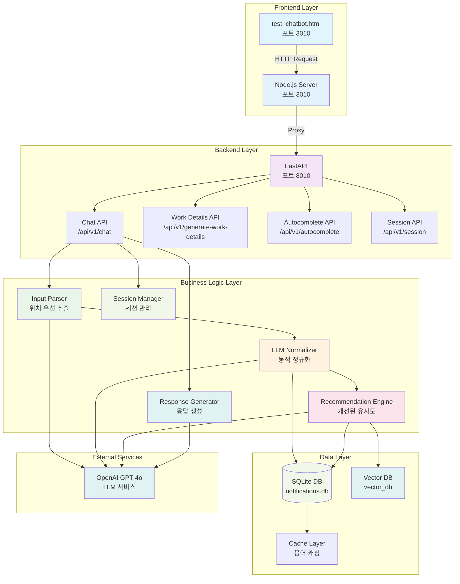

## 🔄 서비스 흐름 다이어그램

### 1. 사용자 입력 처리 흐름 (세션 관리 포함)

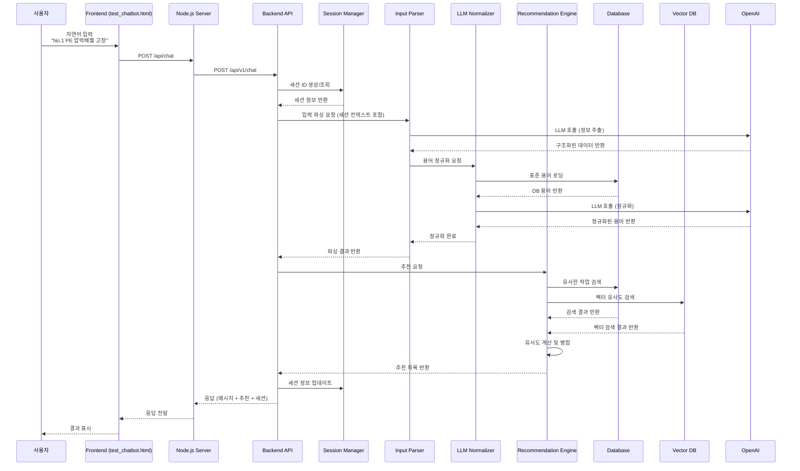

### 2. 위치 기반 검색 흐름

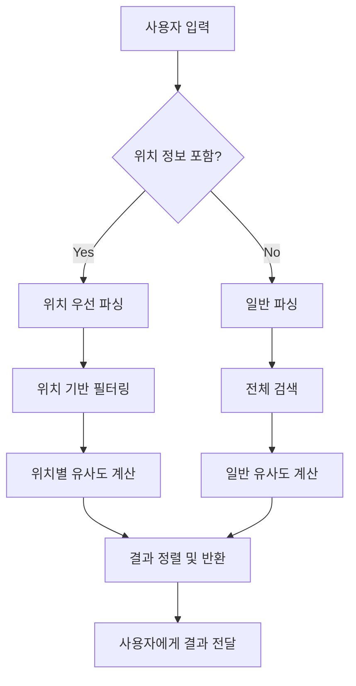

## 🧠 상세 모듈 아키텍처

### 1. 파싱 로직 아키텍처

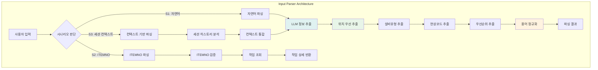

#### 1.1 파싱 로직 상세 흐름

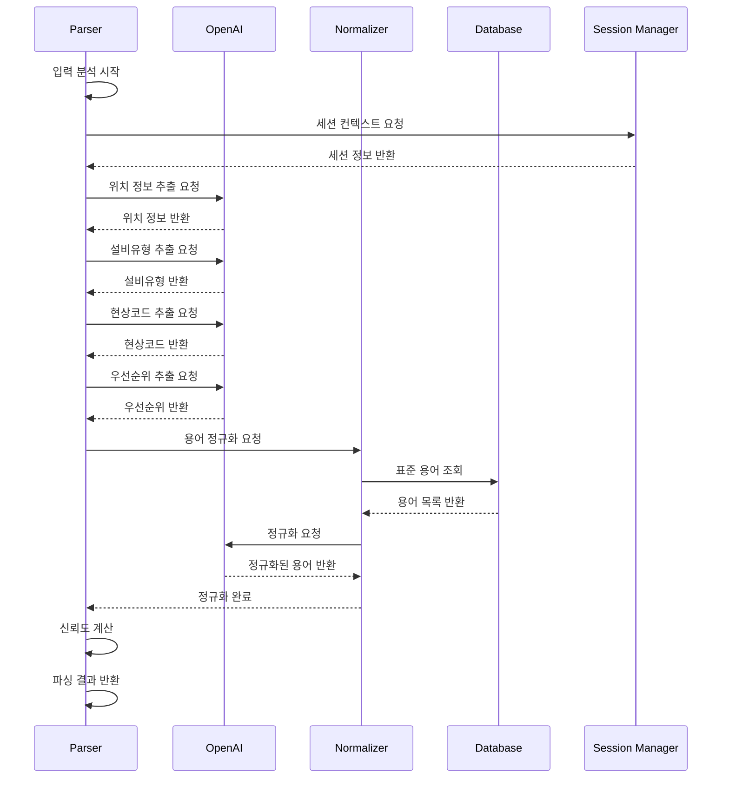

### 2. 정규화 엔진 아키텍처

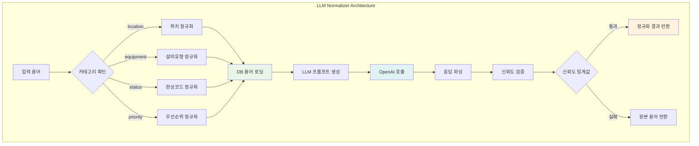

#### 2.1 정규화 프로세스 상세

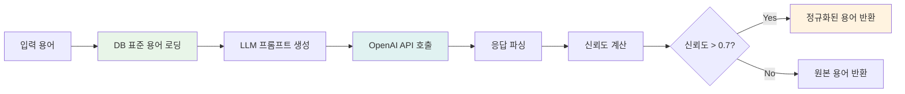

### 3. 유사도 계산 및 추천 로직 아키텍처

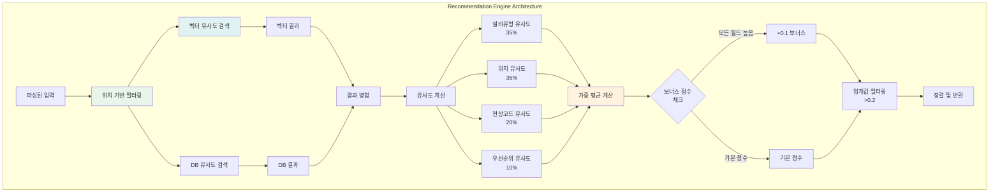

#### 3.1 유사도 계산 상세 프로세스

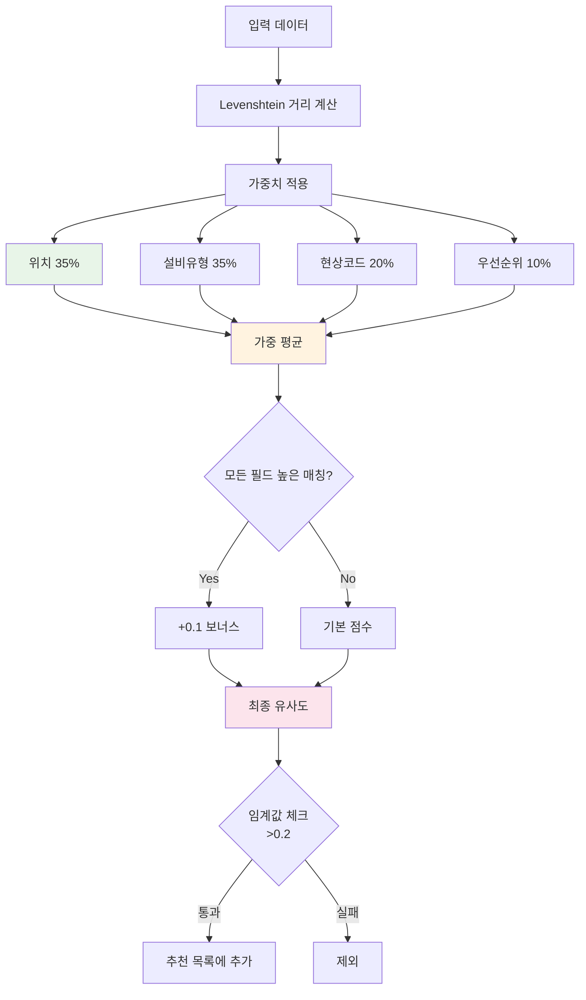

### 4. 응답 생성 아키텍처

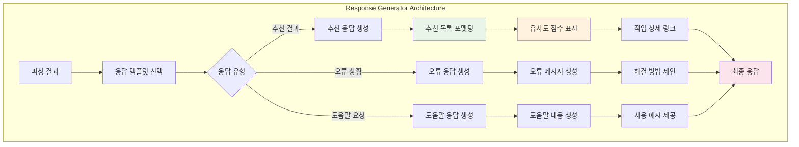

#### 4.1 응답 생성 프로세스

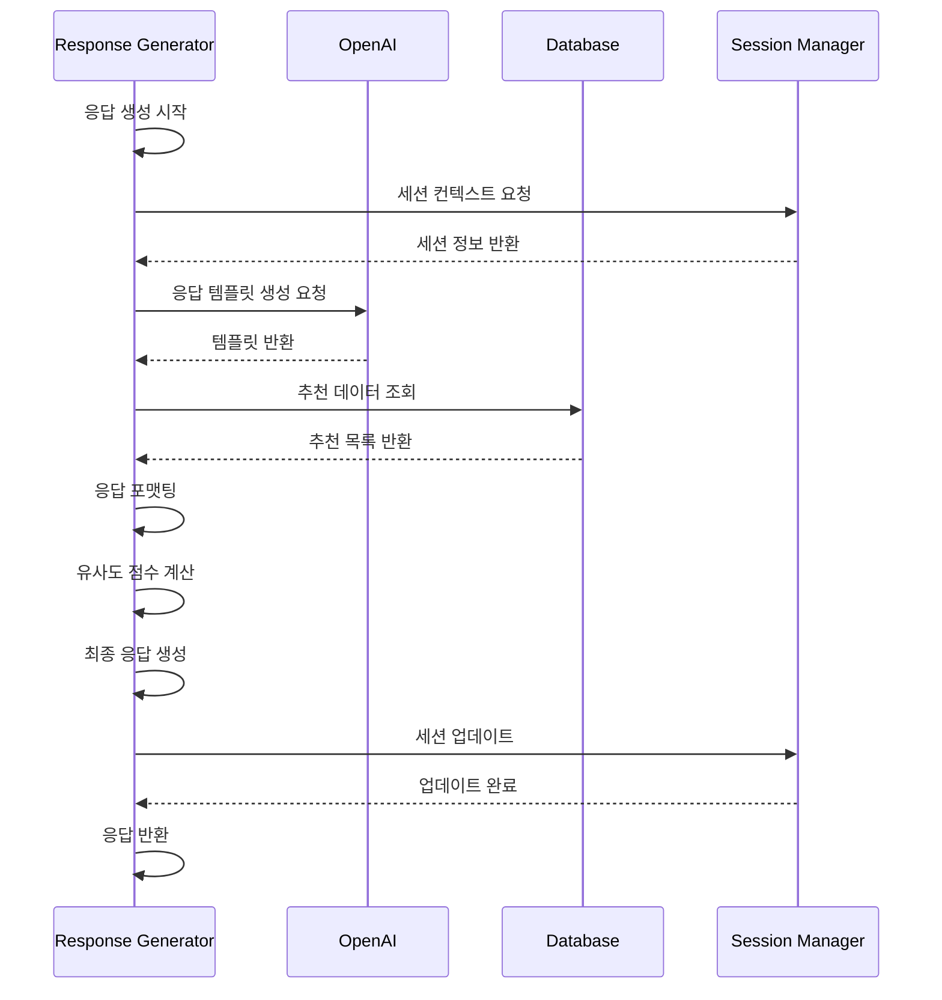

### 5. 세션 관리 아키텍처

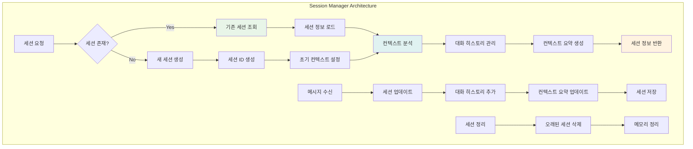

#### 5.1 세션 관리 프로세스

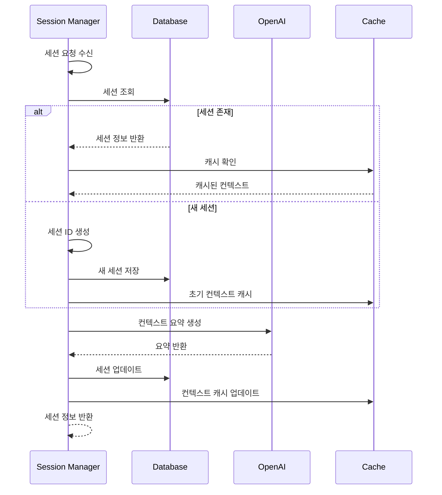

### 6. 자동완성 아키텍처

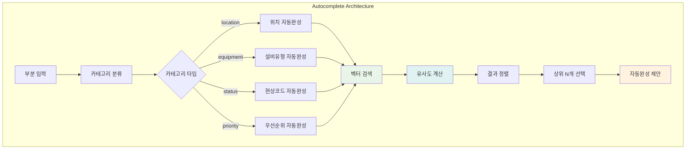

### 7. 벡터 검색 아키텍처

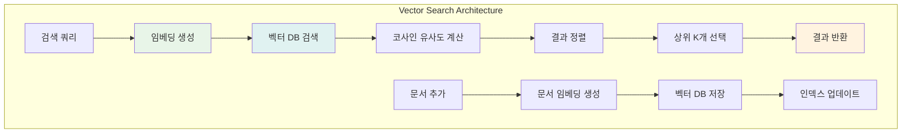

## 🏛️ 모듈별 상세 아키텍처

### 1. 프론트엔드 모듈

#### 1.1 Node.js 서버 (`frontend/server.js`)
- **역할**: 프론트엔드 프록시 서버
- **포트**: 3010
- **기능**:
  - 정적 파일 서빙
  - 백엔드 API 프록시
  - CORS 처리
  - 세션 정보 관리

#### 1.2 챗봇 인터페이스 (`test_chatbot.html`)
- **역할**: 사용자 인터페이스
- **기능**:
  - 실시간 채팅 인터페이스
  - 세션 상태 표시
  - 추천 목록 표시
  - 자동완성 기능

### 2. 백엔드 모듈

#### 2.1 FastAPI 서버 (`backend/main.py`)
- **역할**: 메인 API 서버
- **포트**: 8010
- **기능**:
  - RESTful API 제공
  - 자동 문서 생성
  - 미들웨어 처리

#### 2.2 세션 관리자 (`backend/app/session_manager.py`)
- **역할**: 세션 상태 관리
- **기능**:
  - 세션 생성/조회
  - 대화 컨텍스트 유지
  - 세션별 설정 관리

#### 2.3 입력 파서 (`backend/app/agents/parser.py`)
- **역할**: 자연어 입력 분석
- **기능**:
  - 위치 정보 추출
  - 설비유형 식별
  - 현상코드 매핑
  - 우선순위 결정

#### 2.4 정규화 엔진 (`backend/app/logic/normalizer.py`)
- **역할**: 용어 표준화
- **기능**:
  - 동적 정규화
  - LLM 기반 변환
  - 캐시 관리

#### 2.5 추천 엔진 (`backend/app/logic/recommender.py`)
- **역할**: 유사 작업 추천
- **기능**:
  - 벡터 유사도 검색
  - 위치 기반 필터링
  - 점수 계산 및 정렬

#### 2.6 응답 생성기 (`backend/app/logic/response_generator.py`)
- **역할**: 응답 메시지 생성
- **기능**:
  - 템플릿 기반 응답 생성
  - 컨텍스트 기반 응답
  - 다국어 지원

### 3. 데이터 레이어

#### 3.1 SQLite 데이터베이스 (`data/notifications.db`)
- **역할**: 메인 데이터 저장소
- **테이블**:
  - `notifications`: 작업 이력
  - `equipment_types`: 설비유형
  - `status_codes`: 현상코드
  - `sessions`: 세션 정보

#### 3.2 벡터 데이터베이스 (`data/vector_db`)
- **역할**: 임베딩 벡터 저장
- **기능**:
  - 문장 임베딩 저장
  - 유사도 검색
  - 실시간 업데이트

## 🔧 설정 및 환경

### 포트 구성
- **백엔드**: 8010 (FastAPI)
- **프론트엔드**: 3010 (Node.js)
- **API 문서**: http://localhost:8010/docs

### 환경 변수
```env
BACKEND_PORT=8010
FRONTEND_PORT=3010
DATABASE_URL=sqlite:///./data/notifications.db
VECTOR_DB_PATH=./data/vector_db
OPENAI_API_KEY=your_openai_api_key_here
```

### 데이터 파일
- `[Noti이력].xlsx`: 작업 이력 데이터
- `[현상코드].xlsx`: 현상코드 매핑
- `설비유형 자료_20250522.xlsx`: 설비유형 정보

## 🚀 성능 최적화

### 1. 캐싱 전략
- **용어 캐싱**: 정규화된 용어를 메모리에 캐시
- **세션 캐싱**: 활성 세션 정보를 메모리에 유지
- **벡터 캐싱**: 자주 사용되는 임베딩 벡터 캐시

### 2. 병렬 처리
- **비동기 API**: FastAPI의 비동기 처리 활용
- **벡터 검색**: 병렬 유사도 계산
- **LLM 호출**: 동시 요청 처리

### 3. 확장성 고려사항
- **마이크로서비스**: 모듈별 독립적 배포 가능
- **데이터베이스**: PostgreSQL 마이그레이션 준비
- **캐시**: Redis 도입 고려

## 🔍 모니터링 및 로깅

### 로그 레벨
- **DEBUG**: 개발 환경 상세 로그
- **INFO**: 일반 운영 로그
- **WARNING**: 경고 메시지
- **ERROR**: 오류 메시지

### 모니터링 지표
- API 응답 시간
- 세션 활성 수
- LLM 호출 빈도
- 데이터베이스 성능
- 벡터 검색 정확도

## 📊 데이터 흐름 분석

### 1. 입력 처리 데이터 흐름

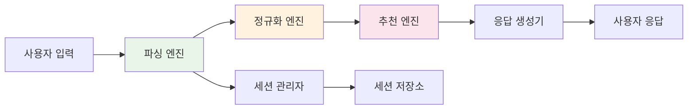

### 2. 벡터 검색 데이터 흐름

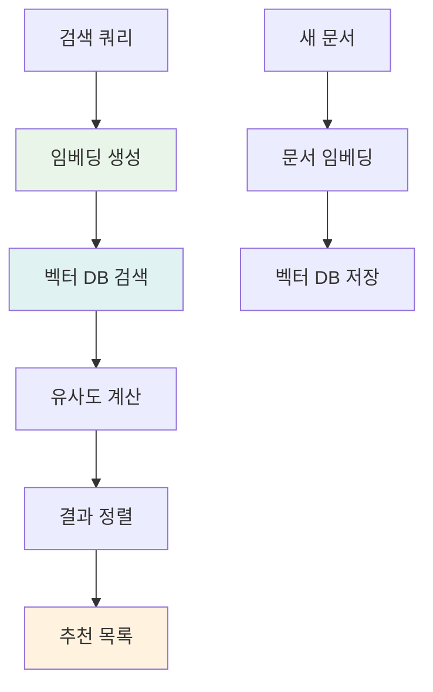

## 🔧 기술 스택 상세

### 백엔드 기술 스택
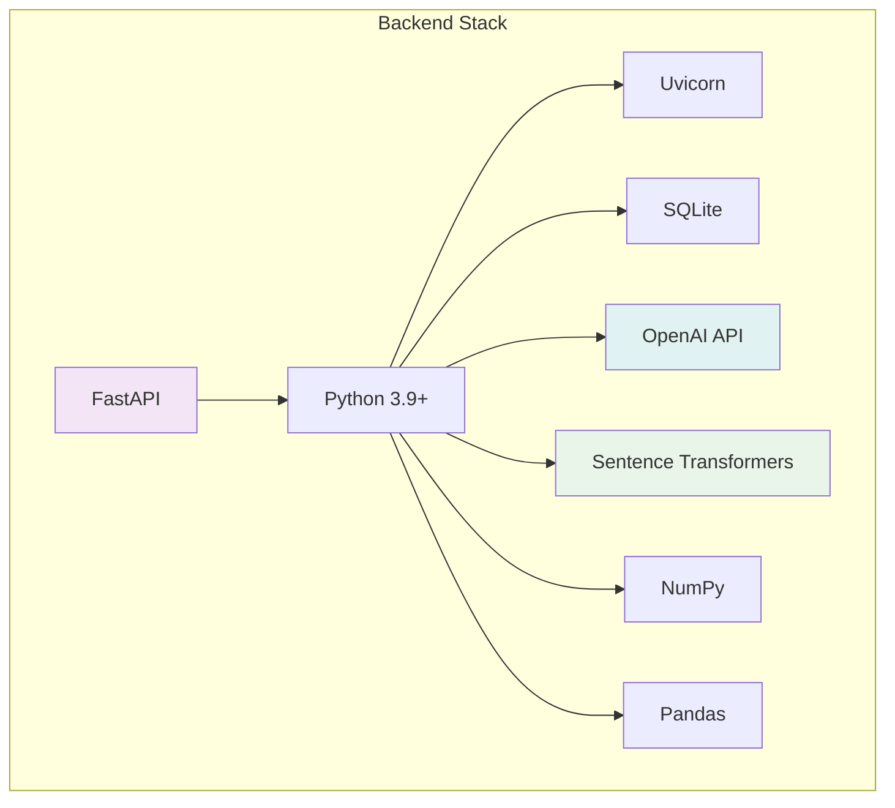

### 프론트엔드 기술 스택
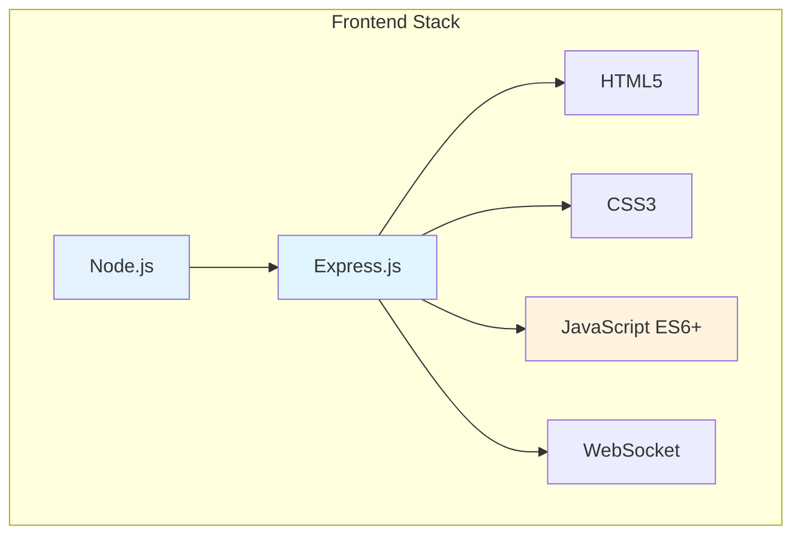

## 🎯 핵심 성능 지표

### 1. 응답 시간 목표
- **파싱**: < 2초
- **정규화**: < 1초
- **추천 생성**: < 3초
- **전체 응답**: < 5초

### 2. 정확도 목표
- **위치 인식**: > 95%
- **설비유형 정규화**: > 90%
- **현상코드 정규화**: > 85%
- **추천 정확도**: > 80%

### 3. 처리량 목표
- **동시 사용자**: 100명
- **초당 요청**: 50회
- **세션 수**: 1000개

## 🔒 보안 아키텍처

### 1. 현재 보안 상태
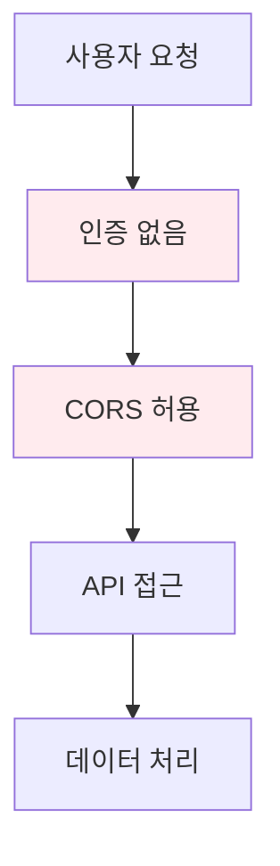

### 2. 향후 보안 강화 계획
```mermaid
graph TD
    A[사용자 요청] --> B[JWT 토큰 인증]
    B --> C[Rate Limiting]
    C --> D[CORS 제한]
    D --> E[API 접근]
    E --> F[데이터 암호화]
    
    style B fill:#e8f5e8
    style C fill:#e8f5e8
    style F fill:#e8f5e8
```

---

**PMark3 시스템 아키텍처** - 세션 관리와 벡터 검색을 포함한 고급 AI 작업요청 생성 시스템의 완전한 아키텍처를 이해하세요! 🚀 
