# PMark2 시스템 아키텍처

## 📋 개요

PMark2는 설비관리 시스템을 위한 자연어 기반 AI 작업요청 생성 어시스턴트입니다. 이 문서는 시스템의 전체 아키텍처, 모듈별 작동 흐름, 그리고 모듈 간 연계를 설명합니다.

## 🏗️ 전체 시스템 아키텍처

```mermaid
graph TB
    subgraph "Frontend Layer"
        UI[chatbot.html<br/>포트 3001]
    end
    
    subgraph "Backend Layer"
        API[FastAPI<br/>포트 8001]
        CHAT[Chat API<br/>/api/v1/chat]
        WORK[Work Details API<br/>/api/v1/generate-work-details]
    end
    
    subgraph "Business Logic Layer"
        PARSER[Input Parser<br/>위치 우선 추출]
        NORM[LLM Normalizer<br/>동적 정규화]
        REC[Recommendation Engine<br/>개선된 유사도]
    end
    
    subgraph "Data Layer"
        DB[(SQLite DB<br/>sample_notifications.db)]
        CACHE[Cache Layer<br/>용어 캐싱]
    end
    
    subgraph "External Services"
        OPENAI[OpenAI GPT-4o<br/>LLM 서비스]
    end
    
    UI -->|HTTP Request| API
    API --> CHAT
    API --> WORK
    
    CHAT --> PARSER
    PARSER --> NORM
    NORM --> REC
    
    PARSER --> OPENAI
    NORM --> OPENAI
    REC --> OPENAI
    
    NORM --> DB
    REC --> DB
    DB --> CACHE
    
    style UI fill:#e1f5fe
    style API fill:#f3e5f5
    style PARSER fill:#e8f5e8
    style NORM fill:#fff3e0
    style REC fill:#fce4ec
    style DB fill:#f1f8e9
    style OPENAI fill:#e0f2f1
```

## 🔄 서비스 흐름 다이어그램

### 1. 사용자 입력 처리 흐름

```mermaid
sequenceDiagram
    participant U as 사용자
    participant UI as Frontend (chatbot.html)
    participant API as Backend API
    participant P as Input Parser
    participant N as LLM Normalizer
    participant R as Recommendation Engine
    participant D as Database
    participant O as OpenAI

    U->>UI: 자연어 입력<br/>"No.1 PE 압력베젤 고장"
    UI->>API: POST /api/v1/chat
    API->>P: 입력 파싱 요청
    P->>O: LLM 호출 (정보 추출)
    O-->>P: 구조화된 데이터 반환
    P->>N: 용어 정규화 요청
    N->>D: 표준 용어 로딩
    D-->>N: DB 용어 반환
    N->>O: LLM 호출 (정규화)
    O-->>N: 정규화된 용어 반환
    N-->>P: 정규화 완료
    P-->>API: 파싱 결과 반환
    API->>R: 추천 요청
    R->>D: 유사한 작업 검색
    D-->>R: 검색 결과 반환
    R->>R: 유사도 계산
    R-->>API: 추천 목록 반환
    API-->>UI: 응답 (메시지 + 추천)
    UI-->>U: 결과 표시
```

### 2. 위치 기반 검색 흐름

```mermaid
flowchart TD
    A[사용자 입력] --> B{시나리오 판단}
    B -->|S1: 자연어| C[위치 정보 우선 추출]
    B -->|S2: ITEMNO| D[ITEMNO 조회]
    
    C --> E[LLM 정보 추출]
    E --> F[위치 정규화]
    F --> G[설비유형 정규화]
    G --> H[현상코드 정규화]
    H --> I[우선순위 정규화]
    
    I --> J[위치 기반 DB 검색]
    J --> K{위치 매칭 결과}
    K -->|높은 매칭| L[위치 우선 정렬]
    K -->|낮은 매칭| M[전체 필드 검색]
    
    L --> N[유사도 계산]
    M --> N
    N --> O[임계값 필터링 0.2 이상]
    O --> P[결과 반환]
    
    D --> Q[ITEMNO 검색]
    Q --> R[작업 상세 반환]
    
    style C fill:#e8f5e8
    style J fill:#e8f5e8
    style L fill:#e8f5e8
```

### 3. 유사도 계산 프로세스

```mermaid
flowchart LR
    A[입력 데이터] --> B[설비유형 매칭 35%]
    A --> C[위치 매칭 35%]
    A --> D[현상코드 매칭 20%]
    A --> E[우선순위 매칭 10%]
    
    B --> F[Levenshtein 거리 계산]
    C --> F
    D --> F
    E --> F
    
    F --> G[가중 평균 계산]
    G --> H{모든 필드 높은 매칭?}
    H -->|Yes| I[보너스 점수 +0.1]
    H -->|No| J[기본 점수]
    
    I --> K[최종 유사도 점수]
    J --> K
    
    K --> L{임계값 체크 0.2 이상}
    L -->|통과| M[추천 목록에 추가]
    L -->|실패| N[제외]
    
    style C fill:#e8f5e8
    style F fill:#fff3e0
    style K fill:#fce4ec
```

## 🧩 모듈별 상세 구조

### 1. Input Parser 모듈

```mermaid
graph TD
    subgraph "Input Parser (parser.py)"
        A[parse_input] --> B{시나리오 판단}
        B -->|S1| C[자연어 파싱]
        B -->|S2| D[ITEMNO 파싱]
        
        C --> E[LLM 정보 추출]
        E --> F[위치 우선 추출]
        F --> G[설비유형 추출]
        G --> H[현상코드 추출]
        H --> I[우선순위 추출]
        
        I --> J[용어 정규화]
        J --> K[신뢰도 계산]
        
        D --> L[ITEMNO 검증]
        L --> M[작업 조회]
    end
    
    style F fill:#e8f5e8
    style J fill:#fff3e0
```

### 2. LLM Normalizer 모듈

```mermaid
graph TD
    subgraph "LLM Normalizer (normalizer.py)"
        A[normalize_term] --> B{카테고리 확인}
        B -->|location| C[위치 정규화]
        B -->|equipment| D[설비유형 정규화]
        B -->|status| E[현상코드 정규화]
        B -->|priority| F[우선순위 정규화]
        
        C --> G[DB 용어 로딩]
        D --> G
        E --> G
        F --> G
        
        G --> H[LLM 프롬프트 생성]
        H --> I[OpenAI 호출]
        I --> J[응답 파싱]
        J --> K[신뢰도 검증]
        K --> L[정규화 결과 반환]
    end
    
    style G fill:#e8f5e8
    style I fill:#e0f2f1
```

### 3. Recommendation Engine 모듈

```mermaid
graph TD
    subgraph "Recommendation Engine (recommender.py)"
        A[get_recommendations] --> B[DB 검색]
        B --> C[위치 기반 정렬]
        C --> D[유사도 계산]
        
        D --> E[설비유형 유사도<br/>35%]
        D --> F[위치 유사도<br/>35%]
        D --> G[현상코드 유사도<br/>20%]
        D --> H[우선순위 유사도<br/>10%]
        
        E --> I[가중 평균 계산]
        F --> I
        G --> I
        H --> I
        
        I --> J{보너스 점수<br/>체크}
        J -->|모든 필드 높음| K[+0.1 보너스]
        J -->|기본 점수| L[기본 점수]
        
        K --> M[임계값 필터링]
        L --> M
        M --> N[정렬 및 반환]
    end
    
    style C fill:#e8f5e8
    style F fill:#e8f5e8
    style I fill:#fff3e0
```

### 4. Database Manager 모듈

```mermaid
graph TD
    subgraph "Database Manager (database.py)"
        A[search_similar_notifications] --> B{위치 입력 확인}
        B -->|있음| C[위치 기반 검색]
        B -->|없음| D[전체 필드 검색]
        
        C --> E[위치 우선 정렬]
        D --> F[기본 정렬]
        
        E --> G[SQL 쿼리 실행]
        F --> G
        
        G --> H[결과 필터링]
        H --> I[정규화 용어 제공]
        I --> J[검색 결과 반환]
        
        K[load_standard_terms_from_db] --> L[DB에서 용어 로딩]
        L --> M[카테고리별 분류]
        M --> N[정규화 엔진에 제공]
    end
    
    style C fill:#e8f5e8
    style E fill:#e8f5e8
    style L fill:#e8f5e8
```

## 🔗 모듈 간 연계 다이어그램

```mermaid
graph TB
    subgraph "API Layer"
        CHAT[Chat API]
        WORK[Work Details API]
    end
    
    subgraph "Business Logic Layer"
        PARSER[Input Parser]
        NORM[LLM Normalizer]
        REC[Recommendation Engine]
    end
    
    subgraph "Data Layer"
        DB[Database Manager]
        CACHE[Cache Manager]
    end
    
    subgraph "External Services"
        OPENAI[OpenAI API]
    end
    
    CHAT --> PARSER
    CHAT --> REC
    WORK --> REC
    
    PARSER --> NORM
    PARSER --> OPENAI
    NORM --> OPENAI
    REC --> OPENAI
    
    NORM --> DB
    REC --> DB
    DB --> CACHE
    
    PARSER -.->|용어 정규화| NORM
    NORM -.->|표준 용어| DB
    DB -.->|검색 결과| REC
    REC -.->|추천 목록| CHAT
    
    style PARSER fill:#e8f5e8
    style NORM fill:#fff3e0
    style REC fill:#fce4ec
    style DB fill:#e8f5e8
```

## 📊 데이터 흐름 다이어그램

```mermaid
flowchart LR
    subgraph "Input Data"
        A[사용자 자연어 입력]
        B[위치 정보]
        C[설비유형]
        D[현상코드]
        E[우선순위]
    end
    
    subgraph "Processing"
        F[LLM 파싱]
        G[용어 정규화]
        H[DB 검색]
        I[유사도 계산]
    end
    
    subgraph "Output"
        J[구조화된 데이터]
        K[정규화된 용어]
        L[검색 결과]
        M[유사도 점수]
    end
    
    subgraph "UI Display"
        N[위치 표시]
        O[설비유형 표시]
        P[현상코드 표시]
        Q[우선순위 표시]
        R[유사도 퍼센트]
    end
    
    A --> F
    F --> J
    J --> G
    G --> K
    K --> H
    H --> L
    L --> I
    I --> M
    
    J --> N
    J --> O
    J --> P
    J --> Q
    M --> R
    
    style B fill:#e8f5e8
    style N fill:#e8f5e8
    style M fill:#fce4ec
    style R fill:#fce4ec
```

## 🎯 핵심 개선사항 아키텍처

### 1. 위치 기반 검색 강화

```mermaid
graph LR
    A[사용자 입력] --> B[위치 정보 추출]
    B --> C[위치 정규화]
    C --> D[위치 기반 DB 검색]
    D --> E[위치 우선 정렬]
    E --> F[유사도 계산]
    F --> G[추천 결과]
    
    style B fill:#e8f5e8
    style D fill:#e8f5e8
    style E fill:#e8f5e8
```

### 2. 동적 정규화 시스템

```mermaid
graph TD
    A[입력 용어] --> B[DB 용어 로딩]
    B --> C[실제 DB 데이터]
    C --> D[LLM 정규화]
    D --> E[정규화된 용어]
    E --> F[DB 매칭]
    F --> G[정확한 검색 결과]
    
    style B fill:#e8f5e8
    style C fill:#e8f5e8
    style F fill:#e8f5e8
```

### 3. 개선된 유사도 계산

```mermaid
graph LR
    A[입력 데이터] --> B[Levenshtein 거리]
    B --> C[가중치 적용]
    C --> D[위치 35%]
    C --> E[설비유형 35%]
    C --> F[현상코드 20%]
    C --> G[우선순위 10%]
    
    D --> H[가중 평균]
    E --> H
    F --> H
    G --> H
    
    H --> I[보너스 점수]
    I --> J[최종 유사도]
    
    style D fill:#e8f5e8
    style H fill:#fff3e0
    style J fill:#fce4ec
```

## 🔧 기술 스택 아키텍처

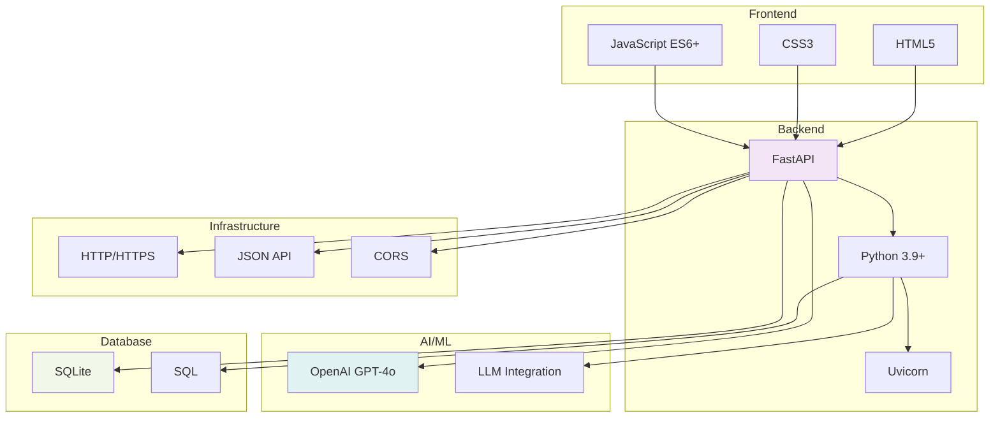

## 📈 성능 최적화 아키텍처

```mermaid
graph TD
    A[사용자 요청] --> B{캐시 확인}
    B -->|캐시 히트| C[캐시된 결과 반환]
    B -->|캐시 미스| D[DB 쿼리]
    
    D --> E[위치 인덱스 활용]
    E --> F[검색 결과]
    F --> G[유사도 계산]
    G --> H[결과 캐싱]
    H --> I[응답 반환]
    
    C --> I
    
    style B fill:#fff3e0
    style E fill:#e8f5e8
    style H fill:#fff3e0
```

이 문서는 PMark2 시스템의 전체 아키텍처와 모듈별 작동 흐름을 시각적으로 설명합니다. 각 다이어그램은 코드의 변화를 반영하여 자동으로 업데이트되도록 설계되었습니다. 
